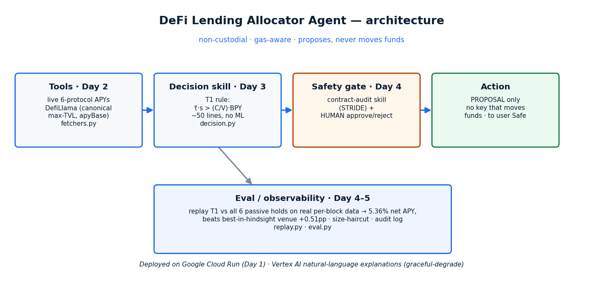

# DeFi Lending Allocator Agent

A **non-custodial, gas-aware USDC rate router**: it watches the supply APY of the
six largest Ethereum lending venues — **Aave V3, Compound V3, Spark, Morpho Blue,
Euler V2, Fluid** — and, when a switch clears its cost, **proposes** moving idle
USDC from one venue to a higher-yielding one for a human to approve. It never
moves funds.

Capstone for the **Google × Kaggle "5-Day AI Agents: Intensive Vibe Coding"**
course, built on the paper *"Event-Time MCDM Allocation across DeFi Lending
Protocols"* (Sergei Solovev, WorldQuant University).

**🔗 Live agent:** <https://defi-allocator-1038590668771.europe-west1.run.app>
 · **Code:** <https://github.com/SergeySolovyev/defi-allocator-agent>
 · **Reproduce headline:** `python scripts/run_replay_demo.py`

## Why this is different

- **The decision is a deterministic ~50-line rule (T1), not a black box.** A
  Cox-hazard ML tier was tested and **lost** out-of-sample — reported openly.
  The edge is event-time resolution + a gas throttle. *Honesty is the moat.*
- **Non-custodial.** The agent proposes; a human signs from their own Safe. The
  agent holds no key that can move funds.
- **Reproducible.** Ships a real per-block data slice; `run_replay_demo.py`
  reproduces the headline number on your machine.

## Headline result (reproducible, `python scripts/run_replay_demo.py`)

Replay over a real per-block slice (Jan–Apr 2026, $1M, net of real gas):

| strategy | net APY | note |
|---|---|---|
| **T1 allocator (us)** | **5.36 %** | 313 switches, **$89** gas |
| hold Euler V2 | 4.85 % | best venue *in hindsight* (unknowable ex-ante) |
| hold Spark | 3.86 % | |
| hold Aave V3 | 3.26 % | the usual "default" park |
| hold Compound V3 | 2.69 % | |

**T1 beats every passive single-protocol hold, including the best-in-hindsight
venue, by +0.51 pp.** The size-haircut table (printed by the demo) honestly shows
the edge eroding as the position grows into the thin venues (Euler ~$16M, Spark
~$29M USDC TVL) — read the row for your size, not the gross headline.

## The rule (T1, paper §III)

```
SWITCH to j  iff   tau_bar_ewma · s_ij  >  (C / V) · BLOCKS_PER_YEAR
```
`s_ij` = cross-protocol spread · `tau_bar_ewma` = EWMA inter-crossover dwell ·
`C` = gas + slippage + MEV · `V` = position size. ~50 lines, no training.
See [`defi_allocator/decision.py`](defi_allocator/decision.py) and the
natural-language contract in [`skills/allocation-decision/SKILL.md`](skills/allocation-decision/SKILL.md).

## Architecture → course days



| course day | piece | file |
|---|---|---|
| Day 2 — Tools | 6-protocol APY fetchers (live DefiLlama / cached panel) | `defi_allocator/fetchers.py` |
| Day 3 — Skills | `allocation-decision` (T1 HOLD/SWITCH) | `skills/allocation-decision/SKILL.md` |
| Day 4 — Skills/Security | `contract-audit` pre-switch gate + STRIDE | `skills/contract-audit/SKILL.md` |
| Day 4 — Human-in-the-loop | propose → human approves (never auto-executes) | `defi_allocator/agent.py` |
| Day 4–5 — Eval / observability | replay + eval vs every passive hold + audit log | `defi_allocator/{replay,eval}.py` |
| Day 1 — Deploy | Cloud Run web UI (approve/reject) | `app/main.py`, `Dockerfile` |

Natural-language explanations use **Vertex AI** (the billed Vertex path — *not*
the region-blocked free Gemini API); the core works without it.

## Course concepts demonstrated (the rubric asks for ≥ 3)

| Key concept (Kaggle rubric) | How this project demonstrates it | Where |
|---|---|---|
| **Agent skills** (e.g. Agents CLI) | Two Agent Skills: `allocation-decision` (the T1 HOLD/SWITCH contract) and `contract-audit` (STRIDE pre-switch gate), authored as `SKILL.md` | `skills/` (Code) |
| **Security features** | Non-custodial by construction (the agent holds no key that can move funds — it only proposes); `contract-audit` STRIDE gate before any switch; no API keys/secrets in the repo | `skills/contract-audit/`, `agent.py` (Code/Video) |
| **Deployability** | Live on **Google Cloud Run** via `gcloud run deploy --source .`; reproducible root `Dockerfile` + documented steps | `Dockerfile`, this README (Video) |

(The decision core is also a genuine **agent** — monitor → propose → human approve/reject — wrapped around a deterministic, auditable rule.)

## Live demo (deployed)

The agent runs live on Cloud Run — open
**<https://defi-allocator-1038590668771.europe-west1.run.app>** to watch it fetch
live supply APYs, apply T1, and propose a switch with **Approve / Reject** buttons
(it logs intent only — it never moves funds). A recent snapshot:

```text
Position $1,000,000 in aave_v3  |  gas 1.0 gwei
PROPOSE SWITCH: aave_v3 -> morpho_blue
E[gain]=$8.5 > C=$0.70 (spread 223.7bp, dwell 1000b)
[ Approve (log intent) ]   [ Reject ]

Live supply APYs
  morpho_blue   5.38 %
  fluid         5.07 %
  spark         3.63 %
  compound_v3   3.18 %
  aave_v3       3.14 %
  euler_v2      2.74 %
```

Live rates are point-in-time and change every block; the figures above are
illustrative. The demo video walks through a **Reject** to show the agent never
auto-executes.

## Run it

```bash
pip install -r requirements.txt

# 1) replay demo: T1 vs the six passive holds (reproduces the table above)
python scripts/run_replay_demo.py --position-usd 1000000

# 2) human-in-the-loop on LIVE rates (proposes a switch, you approve)
python -c "from defi_allocator.agent import human_in_the_loop, T1Allocator; \
           human_in_the_loop(T1Allocator(), start_protocol='aave_v3')"

# 3) web UI locally
uvicorn app.main:app --reload    # then open http://localhost:8000

# tests
pytest -q
```

## Deploy to Cloud Run

```bash
gcloud config set project striking-canyon-499613-f3
gcloud run deploy defi-allocator --source . --region europe-west1 \
    --allow-unauthenticated --set-env-vars USE_VERTEX=1
```

## Honest limitations

Net of gas, **gross of MEV/slippage** (size-haircut table quantifies slippage).
Edge demonstrated on a single 4-month real window at near-zero gas; the gas
throttle's value shows up in high-gas regimes (paper §gas-sensitivity). The live
on-chain execution adapters and a security audit are future work — this capstone
is the **decision agent + honest eval + human-in-the-loop**, deployed.

## License

MIT (see [LICENSE](LICENSE)). Not financial advice; non-custodial; proposals
require human approval.
